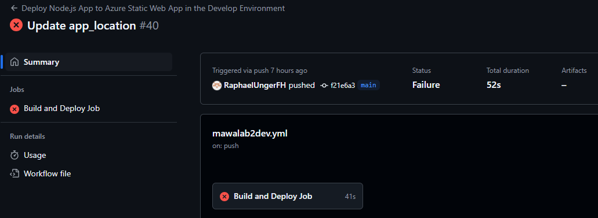

# Lab 2
The second lab includes the creation of an Azure Static Web App and its deployment with a GitHub Actions pipeline. Azure Functions is used to deploy the API and Jest as a test framework. This task requires a build and release pipeline as well as the implementation of Azure Application Insights.

## Links to the Azure Web Apps
- [Development](https://calm-mushroom-042d67f03.5.azurestaticapps.net/)
- [Production](https://gray-water-08b6a5a03.5.azurestaticapps.net/)

## Pipelines
### Build/Test/Deploy Pipeline for Develop Environment
The pipeline for the develop environment is configured in [mawalab2dev.yml](../.github/workflows/mawalab2dev.yml). This Github Action is automatically triggered on every commit in the main branch.

*Build/Test/Deploy Pipeline for Develop Environment in Github Actions*

*Build/Test/Deploy Pipeline Failure*

*Build/Test/Deploy Pipeline Success*

### Release Pipeline for Production Environment
The pipeline for the production environment is configured in [mawalab2prod.yml](../.github/workflows/mawalab2dev.yml). This Github Action is automatically triggered on every commit (which also includes merging from main into release) into the release branch.

*Build/Test/Deploy Pipeline for Production Environment in Github Actions*

## Application Insights
Application Insights are configured for both Azure Static Web Apps directly in the Azure Portal following the [official guide](https://learn.microsoft.com/en-us/azure/static-web-apps/monitor).

*Application Insights for Develop Environment*

*Application Insights for Production Environment*