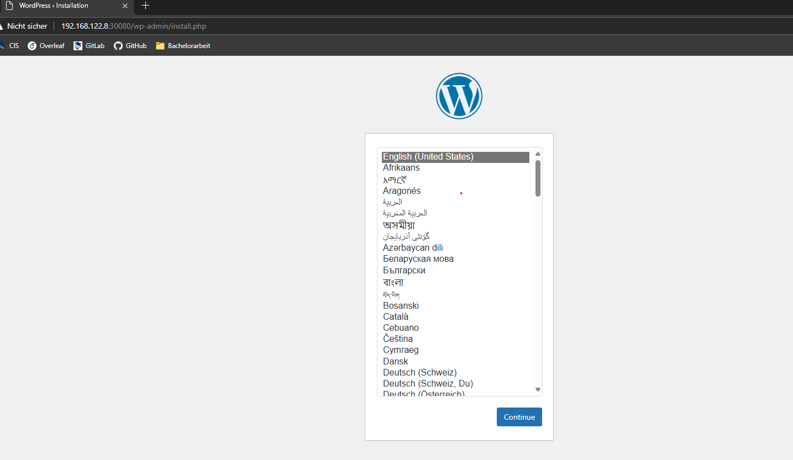
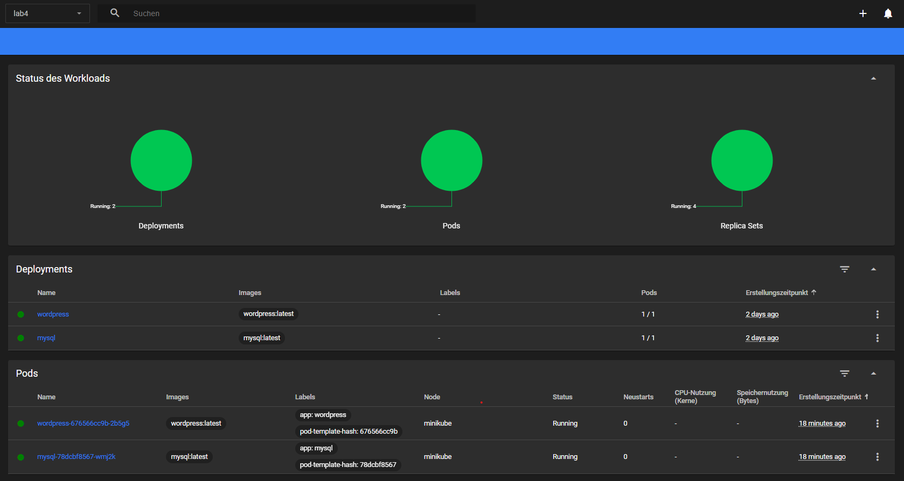

# Lab 4
Lab 4 includes the configuration of a local AKS with [minikube](https://minikube.sigs.k8s.io/docs/) and the configuration as well as the deployment of WordPress and MySQL in a AKS cluster.

## URL & Screenshots
The application can be accessed on ```http://<minikube-ip>:30080``` as described in the last deployment step. In my case the URL is http://192.168.122.8:30080/.


*Deployed Webpage on the local AKS*


*Dashboard of the Namespace after Deployment*


## Configuration
WordPress and MySQL are configured in the corresponding YAML-files called *mysql-deployment.yml* and *wordpress-deployment.yml*.

Both files contain a *Deployment* and *Service* kind.
*Deployment* ensures that a container is created with the necessary environment variables for the database configuration on both sides.
*Service* ensures that a specific container is accessable on specific ports. The MySQL container can be accessed on port 3306 and the WordPress container on port 80 with the node port set to 30080, which is necessary for local access in the browser.

## Deployment Steps
### 1. Start minikube
After installation, [minikube](https://minikube.sigs.k8s.io/docs/) needs to be started for a local AKS cluster with the following command:

```
minikube start
```

### 2. Create Namespace
After startup, a namespace called "lab4" is created like this:
```
kubectl create namespace lab4
```

This namespace is necessary as it is configured in the *mysql-deployment.yml* and *wordpress-deployment.yml* configuration.

### 3. Deploy MySQL and WordPress Configuration
In order to apply both configurations, the following commands need to be executed:
```
kubectl apply -f mysql-deployment.yml
kubectl apply -f wordpress-deployment.yml
```

Checking can be done by getting the pods/services:
```
kubectl get pods --namespace lab4
kubectl get services --namespace lab4
```

Additionally the logs can be fetched like this:
```
kubectl logs <pod-name> --namespace lab4
```

### 4. Access the Webpage
After both pods are ready, the WordPress website can be accessed directly with the local ip address of the minikube. The ip address can be fetched like this:
```
minikube ip
``` 

In the browser the website can be accessed under:
```
http://<minikube-ip>:30080
```